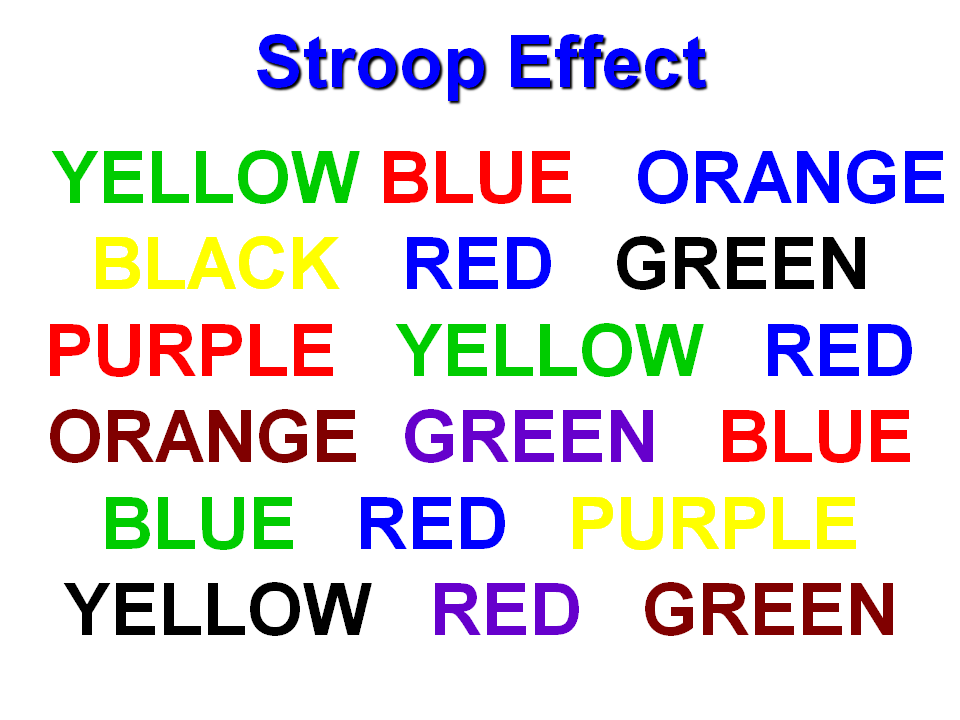

# My Second Project in Machine Learning Basics Nanodegree
# Descriptive Statistics
## Project: Test a Perceptual Phenomenon (Stroop Effect)

-----

### Table Of Contents:
- [What is Stroop Effect](#what-is-stroop-effect)
- [Backgorund Information](#backgorund-information)
- [Data for investigation](#data-for-investigation)
- [Why this project](#why-this-project)
- [Conclusion](#conclusion) 
    - [What I learned](#what-i-learned) 
    - [Evaluation](#evaluation)
    - [Results](#results)

----
### What is Stroop Effect

The Stroop effect is a phenomenon that occurs when you must say the color of a word but not the name of the word. For example, blue might be printed in red and you must say the color rather than the word. For more in detail, Visit [Wikipedia](https://en.wikipedia.org/wiki/Stroop_effect)

-----

### Backgorund Information

In this Stroop task, participants are presented with a list of words, with each word displayed in a color of ink. The participant’s task is to say out loud the color of the ink in which the word is printed. The task has two conditions: a congruent words condition, and an incongruent words condition. In the congruent words condition, the words being displayed are color words whose names match the colors in which they are printed: for example RED, BLUE. In the incongruent words condition, the words displayed are color words whose names do not match the colors in which they are printed: for example PURPLE, ORANGE. In each case, we measure the time it takes to name the ink colors in equally-sized lists. Each participant will go through and record a time from each condition.

Testing my Statistical abilities, In this project i have investigated the Stroop Effect by collecting data from others who have performed the same task and computed some statistics describing the results. Finally, i have interpreted the results in terms of my hypothesis.

You can try out Stroop task for yourself [here](https://faculty.washington.edu/chudler/java/ready.html)

-----

### Data for investigation

`stroopdata.csv` file in this repository contains the data that we have to work with. This dataset contains results from a number of participants in the task. Each row of the dataset contains the performance for one participant, with the first number their results on the congruent task and the second number their performance on the incongruent task. 

The qusetions and results of this data are performed in `Statistical_Analysis_SE.pdf` file.

-----

### Why this project

Statistics is a major component of data analysis, it allows you to investigate data and make inferences based on your observations. A foundation in statistics also allows you to be a consumer of analyses that others perform, and allows you to relate to the conclusions others have drawn from their investigations.

This project is focused on statistics, including designing an experiment and testing a hypothesis. Using statistics to draw valid conclusions about data is an important part of a data analyst's work. When you see a company release a new feature, what do you think went into the decisionmaking? Typically, a business has a goal they want to achieve - for Udacity, it may mean increased enrollments. They would spend a long time user testing and A/B testing to make sure trials of potential products indicate the outcome they wanted.

-----

### Conclusion

#### What I learned:

- How to identify components of an experiment.
- How to use descriptive statistics to describe qualities of a sample.
- How to set up a hypothesis test, make inferences from a sample, and draw conclusions based on the results.
 

#### Evaluation

My project was reviewed by a Udacity reviewer against the **<a href="https://review.udacity.com/#!/projects/4582204201/rubric" target="_blank">Descriptive Statistics project rubric</a>**. All criteria found in the rubric must be *meeting specifications* for me to pass.

#### Results
[My Project Review by an Udacity Reviewer](https://review.udacity.com/#!/reviews/958481)

-----